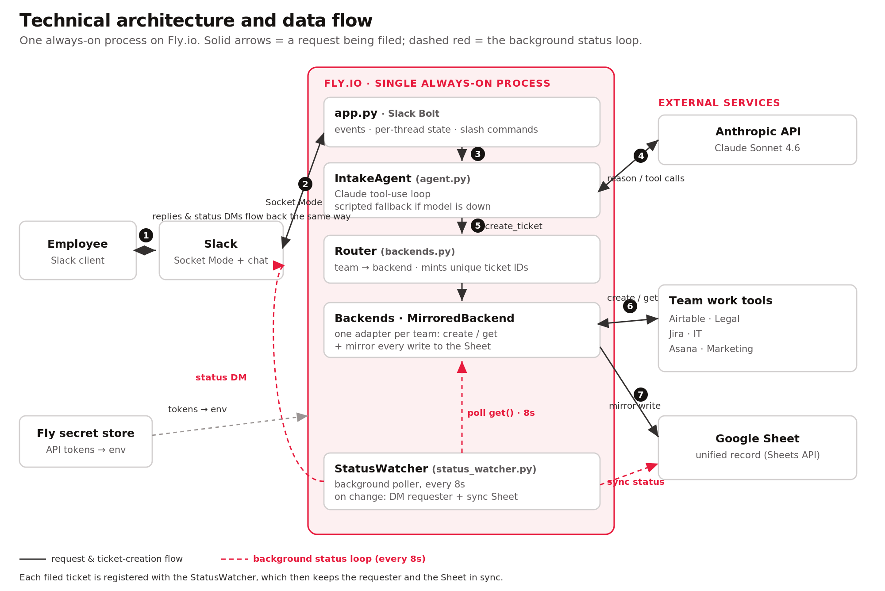

# Universal Intake Agent

One front door for every employee request. A person types `/problem` in Slack and describes what they need in plain language. An agent interprets it, asks only the qualifying questions it still needs, assembles a complete, well-formed request, and routes it into whatever system the destination team already uses. The requester then gets plain-language status updates without learning a new tool.

This is a working proof of concept, deployed and running live: a Slack Socket Mode bot hosted on Fly.io, powered by Claude. Each team's requests are routed into the tool that team actually uses, and every request is also mirrored into a single Google Sheet that serves as the unified record of all intake.

Current routing: **Legal to Airtable, IT to Jira, Marketing to Asana, Product to Google Sheets**, with the Google Sheet mirroring all four.

Companion docs: [`DEMO_SCRIPT.md`](DEMO_SCRIPT.md) (the live walkthrough) and `architecture-one-pager.pdf` (a one-page leave-behind).

## Contents

- [The three stages it demonstrates](#the-three-stages-it-demonstrates)
- [How it works (under the hood)](#how-it-works-under-the-hood)
- [Customizing for SentiLink](#customizing-for-sentilink)
- [What it costs to run](#what-it-costs-to-run)
- [FAQ](#faq)
- [Why this matters](#why-this-matters)
- [Known limitations](#known-limitations)
- [Quick start, setup, and hosting](#quick-start-try-it-in-60-seconds-no-accounts)

## The three stages it demonstrates

1. **Smart intake in Slack.** The agent reads the request, infers the team and pre-fills every field it can, and asks at most one or two short questions at a time. Net better than a static form.
2. **Routing + complete payload.** One structured request is routed to the owning team's tool (Airtable, Jira, Asana, or the Sheet). The problem moves, not the person.
3. **Status visibility.** A background watcher detects status changes in the team's tool and does two things: it DMs the requester a plain-language breadcrumb ("your laptop ticket moved to In Progress, assigned to Dan May") and it mirrors the change into the unified Google Sheet.

## How it works (under the hood)

### Is this an AI agent, or just a Slack app?

It is an AI agent. Slack is only the surface the employee sees. Behind it, the agent runs a reasoning loop: it interprets a plain-language request, decides which team owns it, figures out which details are still missing, asks for only those, and then calls a tool to file the ticket. It is not a fixed decision tree or a branching form. The same agent handles "my laptop battery is dead" and "I need an NDA reviewed for a vendor" without either path being hard-coded, because it reasons about each request rather than matching it to a script. It uses the model's tool-use capability with two tools, `create_ticket` and `get_ticket_status`, and decides for itself when to ask, when to file, and what to put in each field. That is what makes it an agent rather than a chatbot or a workflow.

### The connective tissue

```
Slack (/problem) -> IntakeAgent -> Router -> the owning team's tool
                    (agent.py)    (backends)  Legal=Airtable  IT=Jira  Marketing=Asana  Product=Sheet
                                                   |
                                                   +--> mirrored into ONE Google Sheet  (unified record)
                    StatusWatcher --> DM to the requester  +  status synced into the Sheet
```

Every tool sits behind one tiny interface (`Backend.create` / `Backend.get`). A `MirroredBackend` wraps each team's tool so every ticket is also written to the shared Sheet; the `StatusWatcher` keeps the Sheet's status in sync as work moves. Adding a team is one line in the routing map plus one adapter. That is the whole architectural argument: it generalizes to any team with an inbound queue, while the Sheet stays the single source of truth.

### Technical architecture



The request path (steps 1 to 7) and, in dashed red, the background status loop that runs every 8 seconds.

### The components

| Layer | What it does | Technology |
| --- | --- | --- |
| Surface | Where employees make requests | Slack (Socket Mode bot) |
| Reasoning | Interprets, qualifies, routes, writes the payload | Claude (Sonnet 4.6) |
| Router | Maps each team to its destination, mints a unique ticket ID | Python |
| Adapters | One small interface per tool (`create` / `get`) | Airtable, Jira, Asana, Google Sheets |
| Unified record | Mirrors every ticket and status change into one place | Google Sheet |
| Status watcher | Detects changes in each tool and notifies the requester | Background poller |
| Host | Runs always-on, independent of any laptop | Fly.io |

### The lifecycle of one request

1. Employee types `/problem` in Slack and describes the need in plain language.
2. The agent interprets it, infers the team, and asks only the missing qualifying questions (one or two at a time).
3. It assembles one structured ticket with a unique ID (for example `IT-20260622-0001`), the atomic unit of work that makes everything traceable.
4. The router files that ticket into the owning team's tool, and the same ticket is mirrored into the Google Sheet.
5. When the team moves the work in their tool, the watcher notices, DMs the requester a plain-language update, and syncs the new status into the Sheet.

### Reliability and graceful degradation

- If the model is unavailable (a bad network moment), the agent falls back to a deterministic scripted flow so the conversation still completes.
- If a tool's credentials fail, that team falls back so the bot still responds.
- The bot runs as a single always-on process; Socket Mode needs no public URL, no inbound ports, and no webhooks.

### Files

- `agent.py` - the LLM operator (persona, qualifying logic, tool calls). Falls back to `scripted.py` if the model is unavailable.
- `scripted.py` - deterministic fallback flow so the demo never dies on stage.
- `backends.py` - the Router, the `Ticket` unit of work, every tool adapter, and the `MirroredBackend` that mirrors into the unified Sheet.
- `status_watcher.py` - proactive status breadcrumbs and Sheet sync.
- `app.py` - the Slack Socket Mode front end.
- `cli.py` - a terminal simulator to rehearse without Slack.
- `setup_airtable.py` - one-time builder for the Airtable `Requests` table schema.
- `Dockerfile`, `fly.toml`, `DEPLOY_FLY.md` - always-on Fly.io deployment.

## Customizing for SentiLink

The agent was built to be configured to a company, not rebuilt for it. Almost everything that makes it "SentiLink's" is configuration and a few small adapters on top of the same core. The levers, from fastest to deepest:

1. **Teams and routing map.** The set of teams and where each one's work goes is a one-line config (`INTAKE_ROUTES`). Renaming a team, adding Risk Operations, Data Governance, People, or Finance, and pointing each at its real destination is editing that map. The unique ticket-ID prefixes come from the same place.
2. **Qualifying questions per request type.** What the agent asks is driven by per-team intake requirements: the fields a request must carry before it is "complete." You define those once per request type, and the agent asks only for what is missing, in plain language, instead of showing a long form.
3. **Adapters for SentiLink's tools.** Each destination is a small adapter behind one interface (`create` / `get`). The four here (Airtable, Jira, Asana, Sheets) are examples; SentiLink's real stack, whatever ticketing, case-management, CRM, or internal tools you use, plugs in the same way, one adapter per system, with no change to the agent. If a team's work lives in a database or a warehouse, that is just another adapter.
4. **The intake surface.** Slack is the front door here, but the agent core is surface-agnostic. The same agent can sit behind Microsoft Teams, an email alias, an internal web form, or a portal, whatever employees already use. You choose the door; the brain is the same.
5. **Routing rules, priority, and escalation.** SentiLink's policies become routing logic: anything touching PII auto-flags compliance, contracts over a threshold route to senior counsel, a blocked employee or a live fraud case is High priority, with SLAs and escalation paths per team. These are rules the router applies, not a rebuild.
6. **The system of record.** The Google Sheet is a stand-in. Point the unified record at whatever SentiLink trusts, an internal database, a warehouse table, or a governed datastore, and it becomes the single, permissioned source of truth across teams.
7. **Identity, access, and audit.** Wire in SSO so the requester is known, scope each team's queue so sensitive intake (Legal, People, anything with PII) is permissioned rather than shared, and add immutable audit logging. The unique ticket ID, requester, and timestamp are already the backbone for that.
8. **Domain knowledge and guardrails.** Feed the agent SentiLink's team directory, request taxonomy, and glossary so it routes accurately, with retrieval over an internal knowledge base if the taxonomy is large. Layer on compliance guardrails: redact or refuse sensitive fields at intake, set data residency, and run the model under a BAA or a private deployment for regulated data.

In practice most of this is configuration plus a handful of adapters, the kind of work measured in days, not a project. A first engagement starts by mapping SentiLink's actual teams, the tools each one uses, and the intake requirements per request type, then encoding those into the routing map, the per-team question sets, and the adapters. The architecture does not change; it gets filled in. Two illustrative pieces of that configuration:

**Routing map (illustrative)**

| Team | Routes to |
| --- | --- |
| Legal | Contracts tool |
| Risk Operations | Case-management system |
| Data Governance | Data warehouse |
| People | HRIS |
| IT | Jira |

**Intake requirements per request type (illustrative)**

| Request type | Fields a complete request must carry |
| --- | --- |
| Data-access request | dataset, purpose, PII scope, requested duration |
| Vendor / contract review | counterparty, contract type, dollar value, deadline |
| Fraud case | signal, institution, severity |

Three SentiLink-flavored examples the same agent would handle:

- **Data-access request to Data Governance.** Captures dataset, purpose, and PII scope; auto-flags compliance; files into the governance queue with an approval gate.
- **Vendor or contract review to Legal.** Captures counterparty, contract type, value, and deadline; routes high-value or high-risk contracts to senior counsel.
- **Fraud-operations case to Risk Ops.** Captures the signal, the institution, and severity; assembles a complete case payload and routes it into the analyst queue, with the unified record keeping status visible.

## What it costs to run

Cheap, and predictable. The model is Claude Sonnet 4.6 at $3 per million input tokens and $15 per million output tokens. A complete intake conversation is small: a system prompt, a few short exchanges, and one tool call. That works out to roughly **3 to 8 cents per completed request**, call it a nickel.

- ~1,000 requests/month: roughly **$30 to $80** in model cost.
- ~5,000 requests/month: roughly **$150 to $400**.
- Hosting on Fly.io: about **$5/month** for one small always-on machine.

Cost levers if volume grows: prompt caching drops repeated input to 10% of price, routine steps can run on the cheaper Haiku model, and non-interactive workloads can use the Batch API at 50% off. For an internal intake tool, model cost is a rounding error next to the staff time it saves on clarifying-question back and forth. (Pricing as of mid-2026; verify current rates before quoting.)

## FAQ

### Business and strategy

**Why won't people just keep emailing the team directly?** Because the bot is less work than the status quo, not more: no form to hunt for, no fields to guess, and you get status back. Adoption follows the path of least resistance, and `/problem` can become the only supported door over time.

**Why build this instead of buying ServiceNow or Moveworks?** Those make you standardize on their system and their forms. This does the opposite: every team keeps the tool it already uses, and the employee learns nothing new. For a company already on Jira, Airtable, and Asana, that is faster and cheaper than a migration, and you keep full control of the data, which matters more for a fraud company.

**How do we measure success?** Fewer clarifying-question round trips, faster time-to-first-response per team, and a higher first-try correct-routing rate.

**What would you build next?** Per-team access control, a real datastore, intake analytics and SLAs, and one or two more team integrations.

### Security, privacy, and compliance

**Is it secure?** For the demo, yes, and the design is built to be tightened for production. What touches the data: Slack (the message), the model provider (the request text, to reason about it), the destination tools, and the host. Each is a named, contractible vendor, not an open pipe. API tokens live in the host's encrypted secret store and are never committed to source control. The agent's blast radius is small: it can only file a ticket or look one up, so a manipulated prompt cannot delete data or change permissions.

**Where does the data go, and who sees it?** Slack, the model provider, the four tools, and the host. The model provider (Anthropic) does **not** train on commercial API inputs or outputs by default, retains API logs for only 7 days, and offers zero-data-retention agreements for qualifying enterprises.

**We handle SSNs and identity data. Is sending request text to an LLM acceptable?** This POC uses only synthetic data. For production you would filter sensitive fields at intake, and likely run inside SentiLink's own cloud and compliance boundary so no new processor touches the data.

**Legal intake can be privileged. Why is it in a shared Sheet?** It should not be, for real data. In the POC the unified Sheet is open for visibility; production makes sensitive queues (Legal, HR) permissioned and the unified record a controlled store. (Raising this before it is asked signals maturity.)

**How do we audit who requested what?** Every ticket has a unique ID, requester, timestamp, and source, and lives in the destination tool's own history; production adds immutable logging.

### Could SentiLink adopt this today?

As an internal pilot on non-sensitive queues, effectively yes, it runs today. To make it the company's real front door for regulated data, the path is short and clear:

1. Move it inside SentiLink's own cloud account (inherits existing controls).
2. Replace the Google Sheet with a permissioned datastore and add per-team access control.
3. Add input handling for sensitive fields and immutable audit logging.
4. Decide the model deployment (API with a BAA / zero-retention, or a private deployment).

None of that is research; it is known engineering work on top of a proven design.

### Risks and dependencies

| Risk / dependency | Mitigation |
| --- | --- |
| Model provider dependency | Scripted fallback keeps it working; provider is swappable behind the agent. |
| Tool API availability | Each team falls back independently; the Sheet retains the record. |
| Single host / single process | Trivial to make redundant for non-Socket-Mode designs; for a pilot, one machine is fine. |
| In-memory conversation state | Resets on restart (filed tickets persist); production moves state to a datastore. |
| Prompt injection / misuse | Agent limited to create/lookup; routing validated server-side. |
| Mis-routing | Agent asks rather than guesses when ambiguous; a wrong route is a one-field fix. |
| Sensitive data in a shared record | Add access control before any real data flows. |

### Technical and reliability

**What happens when a tool or the model is down?** Graceful degradation: failed tools fall back, and the model has a scripted fallback so the conversation survives a blip.

**What if a request spans two teams, or it picks the wrong one?** It asks a clarifying question when ambiguous rather than guessing, and a mis-route is a one-field change, not a dead end.

**Why a Google Sheet as the source of truth?** It is the POC's universal, screen-friendly stand-in, and the first thing to replace for production. The architecture treats it as just another backend behind the same interface.

## Why this matters

### Why would I care about this?

Intake is a universal tax. Every team has a different door, every door leaks incomplete information, and employees lose time both submitting work and chasing its status. This removes that tax with one front door, while letting every team keep working exactly as they do today. The win is not a new tool; it is less friction across the whole company with no migration.

### How this translates to other SentiLink problems

The reusable pattern is: **a natural-language front end, a reasoning layer that interprets and structures the request, an action into the systems you already have, and a status loop back to the person.** That shape fits far more than intake. A few examples in SentiLink's world:

- **Fraud and analyst operations:** triage and route inbound cases, assemble complete case context, draft analyst notes, and summarize patterns, all into the tools analysts already use.
- **Any internal inbound queue:** data-access requests, vendor and security reviews, customer-escalation routing, all the same front-door pattern.
- **Knowledge and reporting:** plain-language questions over internal data, with the answer assembled and routed rather than copy-pasted between systems.

This demo is one instance of a pattern that can be pointed at many internal workflows, with the same architecture and the same guardrails.

### How we empower employees to build POCs for their own workflows

The most important takeaway is how fast this came together. A working, multi-tool, AI-powered internal tool was built in an afternoon by one person, using AI-assisted coding and the teams' existing tools. That is the real unlock: domain experts can now prototype solutions to their own pain points without a full engineering project. To make that a capability rather than a one-off:

1. **Lower the barrier:** a small library of vetted connectors and templates (the adapter pattern here is exactly that) so people start from working pieces.
2. **A safe sandbox:** a sanctioned environment with synthetic data only and clear guardrails, so experiments cannot touch real PII.
3. **Light guardrails, not gates:** a simple security checklist and a review path so good POCs can graduate to production without people going around IT.
4. **A path to production:** a known set of steps (access control, datastore, deploy in our cloud) so a promising prototype has somewhere to go.

Enable that, and every team lead can do for their workflow what this demo did for intake.

## Known limitations

- Synthetic data only; no real PII has touched this build.
- The unified Sheet is currently open to anyone with access; needs per-team access control before real data.
- Conversation state and the ticket counter live in memory and reset on restart; filed records persist in the tools and the Sheet.
- One host machine (correct for a Socket Mode pilot, not yet redundant).
- Sheet-to-tool sync is one-directional (tool to Sheet) by design.

These are scope choices for a few-hour proof of concept, not design flaws. Each has a known, ordinary fix on the path to production.

---

## Quick start: try it in 60 seconds, no accounts

```bash
pip install -r requirements.txt
python cli.py
```

This runs the full intake conversation in your terminal against an in-memory destination, no credentials needed. Try "I need a new laptop", answer the questions, then `/status <the-ticket-id>` it prints. Use `/advance <id> "In Progress" Dan May` to simulate the team moving it, then `/status` again. Add `--live` to use real Claude (needs `ANTHROPIC_API_KEY`).

## Full setup for the live Slack demo

Work top to bottom. You can stop after any destination and the rest stay on the Sheet.

### 1. Python deps

```bash
pip install -r requirements.txt
cp .env.example .env
```

### 2. The agent brain (Anthropic)

Create an API key at console.anthropic.com and put it in `.env` as `ANTHROPIC_API_KEY`. Cost is a few cents for a whole demo. If you leave it out, the bot runs the scripted fallback instead, which is fine but less impressive.

### 3. Slack app (Socket Mode, no public URL needed)

1. Go to api.slack.com/apps, click **Create New App**, choose **From an app manifest**, pick a workspace (a free personal/test workspace is perfect), and paste `slack_app_manifest.yaml`.
2. In the app's **Basic Information**, under **App-Level Tokens**, generate a token with the `connections:write` scope. That value (starts `xapp-`) is `SLACK_APP_TOKEN`.
3. Under **Socket Mode**, confirm it is enabled.
4. Under **Install App**, install to the workspace. Copy the **Bot User OAuth Token** (starts `xoxb-`) into `SLACK_BOT_TOKEN`.
5. Put both tokens in `.env`.

### 4. Google Sheet (default destination and unified record)

1. Create a Google Sheet. Copy its ID from the URL (`docs.google.com/spreadsheets/d/THIS_PART/edit`) into `GOOGLE_SHEET_ID`. The bot creates a `Requests` tab and headers on first write.
2. Create a service account so the bot can write to it:
   - In console.cloud.google.com, create (or pick) a project.
   - Enable the **Google Sheets API** for that project.
   - **APIs & Services -> Credentials -> Create Credentials -> Service account.** Create it, then under its **Keys** tab, **Add key -> JSON**. Download the file, save it next to the code as `service_account.json`, and point `GOOGLE_SERVICE_ACCOUNT_FILE` at it.
   - Open the JSON, copy the `client_email`, and **Share** your Google Sheet with that email as **Editor**. This step is the one people forget.
3. Free. No paid Google account required.

### 5. Run it

```bash
python app.py
```

You should see the routing map print and "Intake bot running (Socket Mode)". In Slack, DM the bot or type `/problem`. To show status visibility, edit a row's **Status** cell in the Sheet (e.g. to `In Progress`) and add an **Assignee**; within about 8 seconds the bot DMs the requester.

### 6. Always-on hosting (optional)

To run it independent of your laptop, deploy to Fly.io. The same `app.py` runs as a single always-on Socket Mode worker (keep it to one machine, since Socket Mode would double-reply with two). See `DEPLOY_FLY.md` for the full steps; in short: `fly apps create`, push secrets with `fly secrets import`, then `fly deploy`. The live demo currently runs this way.

## Routing and the unified Sheet

`INTAKE_ROUTES` in `.env` maps each team to its tool. The live configuration is:

```
INTAKE_ROUTES=legal=airtable,marketing=asana,it=jira
DEFAULT_DESTINATION=sheet            # any team not listed (e.g. product) uses the Sheet
```

Anything you do not configure stays on the Sheet. If a tool's credentials are missing or wrong, that team automatically falls back to an in-memory stub so the demo still runs.

**The Sheet as the unified record.** Whenever a team is routed to Airtable/Jira/Asana, its tickets are still mirrored into the Google Sheet, and status/assignee changes in the tool are synced back to the Sheet by the watcher (one-directional, tool to Sheet). So the Sheet always holds every request across every team and reflects the latest status. Disable mirroring with `MIRROR_TO_SHEET=false`.

### Cost and access plan for the real tools

Good news: none of these require a purchase for the demo. All have free tiers with full API access.

| Tool | Cost for the demo | What you need | Where |
| --- | --- | --- | --- |
| **Google Sheets** | Free | Service-account JSON, share the sheet | console.cloud.google.com |
| **Jira Cloud** | Free (up to 10 users) | Email + API token, a project key | id.atlassian.com/manage-profile/security/api-tokens |
| **Asana** | Free | Personal access token, a project id | app.asana.com, Settings -> Apps -> Developer |
| **Airtable** | Free | Personal access token, base id | airtable.com/create/tokens |

Set up notes:

- **Jira:** create a free Jira Cloud site, make a project (note its key, e.g. `IT`), create an API token, and set `JIRA_BASE_URL`, `JIRA_EMAIL`, `JIRA_API_TOKEN`, `JIRA_PROJECT_KEY`. The intake ticket id is embedded in the issue summary so status lookups work without custom fields.
- **Asana:** create a personal access token and a project, set `ASANA_TOKEN` and `ASANA_PROJECT_ID`. The full payload goes in the task notes (free tier has no custom fields).
- **Airtable:** create a base and a personal access token (scopes `data.records:read`/`write` plus `schema.bases:read`/`write`), set `AIRTABLE_TOKEN`, `AIRTABLE_BASE_ID`, `AIRTABLE_TABLE`, then run `python setup_airtable.py` once to build the `Requests` table with the exact columns the bot writes.

The only thing that could cost money is upgrading a tool for more than 10 users or advanced features, which a demo does not need.

## Notes for presenting

- The bot runs on Fly.io, so it answers in Slack with nothing running locally. Run `fly logs` in a terminal you can glance at; it streams every routing decision, mirror write, and status notification, which is a nice thing to narrate. (Locally, `python app.py` does the same.)
- Have the four destinations open in browser tabs (Airtable, Jira, Asana, Google Sheet) so each request can be seen landing in its tool and in the unified Sheet.
- If the venue wifi is shaky, the scripted fallback means the conversation still works; the agent just gets less clever. You can also rehearse entirely in `cli.py`.
- See `DEMO_SCRIPT.md` for a word-for-word walkthrough of the scenarios.
